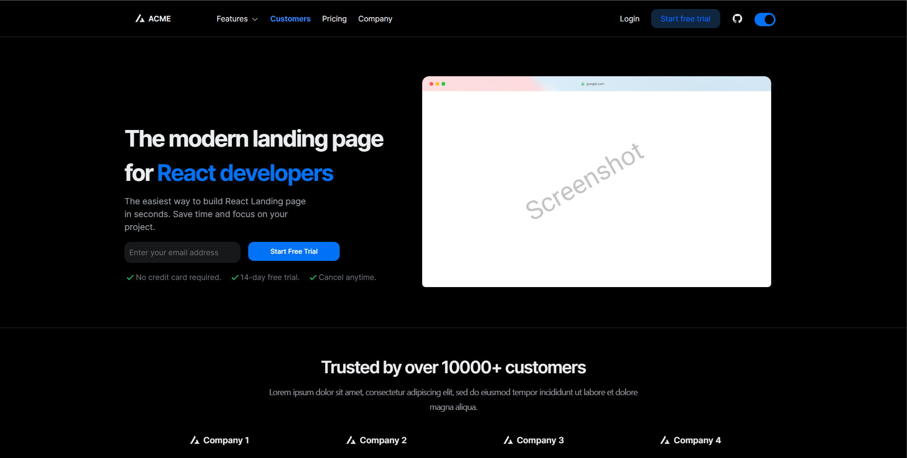
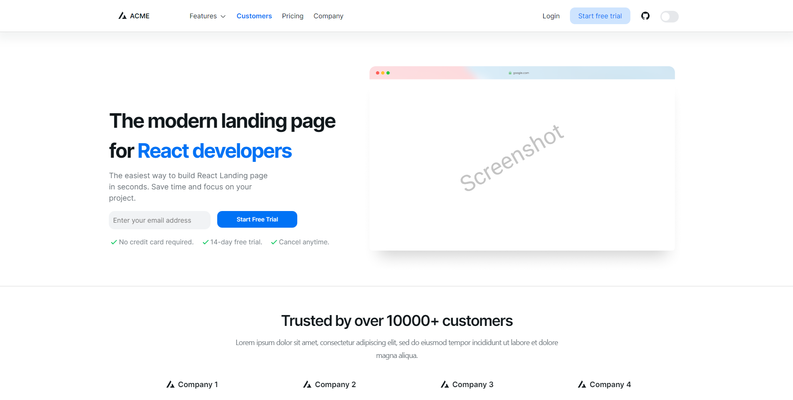

# NextJS and NextUI Landing Page Template

You can deploy here directly to vercel [](https://vercel.com/import/project?template=https://github.com/Siumauricio/landing-template-nextui)

This is a template for NextJS and NextUI. 

[NextJS](https://nextjs.org/) 
[NextUI](https://nextui.org/)

You can see the demo here: https://landing-template-nextui.vercel.app/
For improve this template, you can create a pull request or open an issue here [Issues](https://github.com/Siumauricio/landing-template-nextui/issues) or [Pull Request](
    https://github.com/Siumauricio/landing-template-nextui/pulls)

### Dark Mode


### Light Mode


- Hero Section
- Features Section 1
- Features Section 2
- Features Section 3
- Testimonials Section
- CTA Section
- Pricing Section
- FAQ Section
- Footer Section
- Dark Mode Support
- Full Responsive

## For Run

Install dependencies

    
```bash
npm install
```

Start the server

    
        
```bash
npm run dev
```

Now you can visit https://localhost:3000 in your browser.
